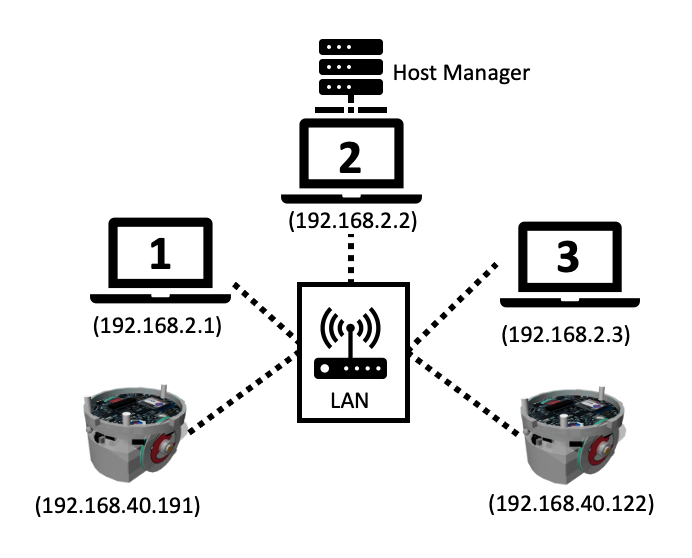
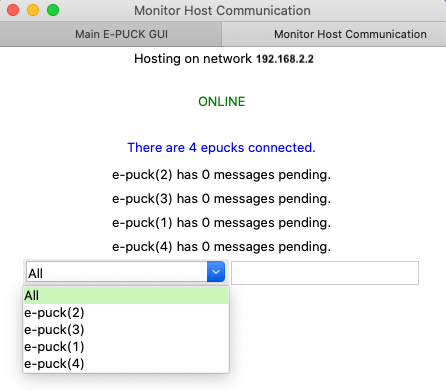

Communication
================

Getting started with the communication

Goals 
--------

* Here, you will learn how to use the communication for the e-pucks
* You will learn these functions : **init_client_communication()**, **init_webots_communication()** 
* Optionally, use the webots communication (only with simulated e-pucks)

Short Exaplanation 
-----------------------

The communication make it possible to interchange data between the e-pucks and you.

As reference of the the above picture: 
    * Computer 2 acts as the host manager. 
  
    * Computers 1 and 3 connect to the open port of computer 2 to put and retrieve data in the dictionnary of the host manager.

Each e-puck that is connected to host manager has each of them a stack of 30 messages to avoid overflow.

Example 
---------

First you need to create a host manager on a computer with the help of the GUI, in our example it will be computer with the ip address 192.168.2.2.

.. note::
    More information to launch the GUI in the Graphic User Interface section

Once is created, the host manager tells you that to the host manager. 

Robots will start to appear in the list when they are connected to the list. 

Secondly, you need to launch the robots and call **init_client_communication()** to connect to the host manager. 

.. code-block:: python

    from unifr_api_epuck import wrapper

    robot = wrapper.get_robot()
    robot.init_client_communication('192.168.2.2') #connect to computer 2

    while robot.go_on():
        if robot.get_id() != 'e-puck(2)' and robot.has_receive_msg():
            print(robot.receive_msg())

        if robot.get_id() == 'e-puck(2)':
            robot.send_msg('Hey I am e-puck(2)')

You must always keep checking if the robot has received messages with **has_receive_msg()** otherwise the host manager will consider that the robot does not longer wants to communicate.

(Optional) Use the Webots Communication
--------------------------------------------

It is possible to use the emitter and receiver of webots.

To use it:
    * You must only use simulated robots and it can only send string between them.
    * The GUI should **not** be used.
    * Replace init_client_communication() with **init_webots_communication()**

.. code-block:: python

    from unifr_api_epuck import wrapper

    robot = wrapper.get_robot()
    robot.init_webots_communication()

    while robot.go_on():
        if robot.get_id() != 'e-puck(2)' and robot.has_receive_msg():
            print(robot.receive_msg())

        if robot.get_id() == 'e-puck(2)':
            robot.send_msg('Hey I am e-puck(2)')

