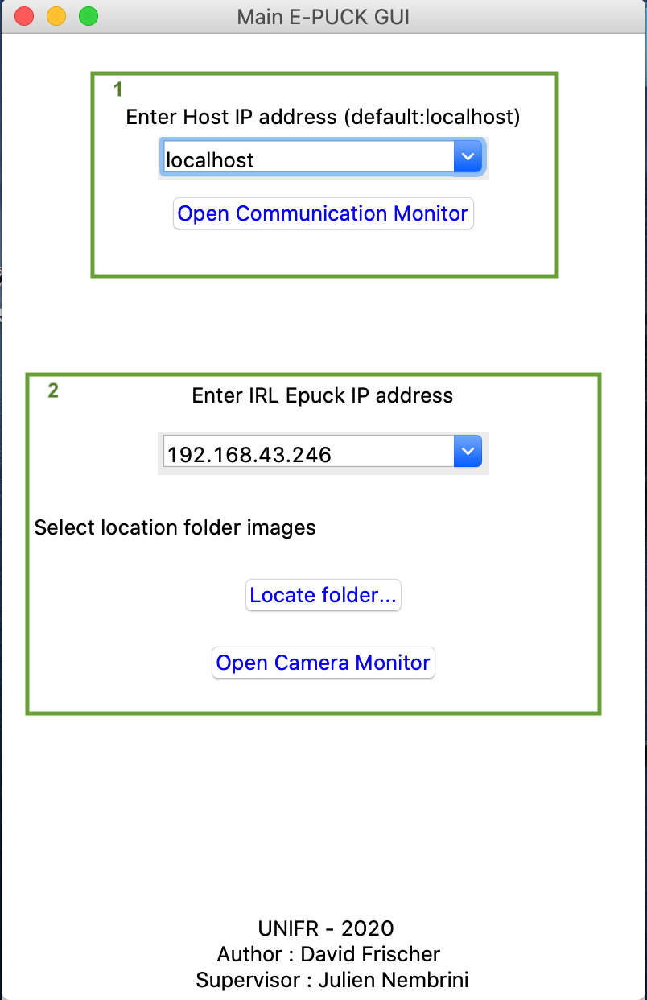
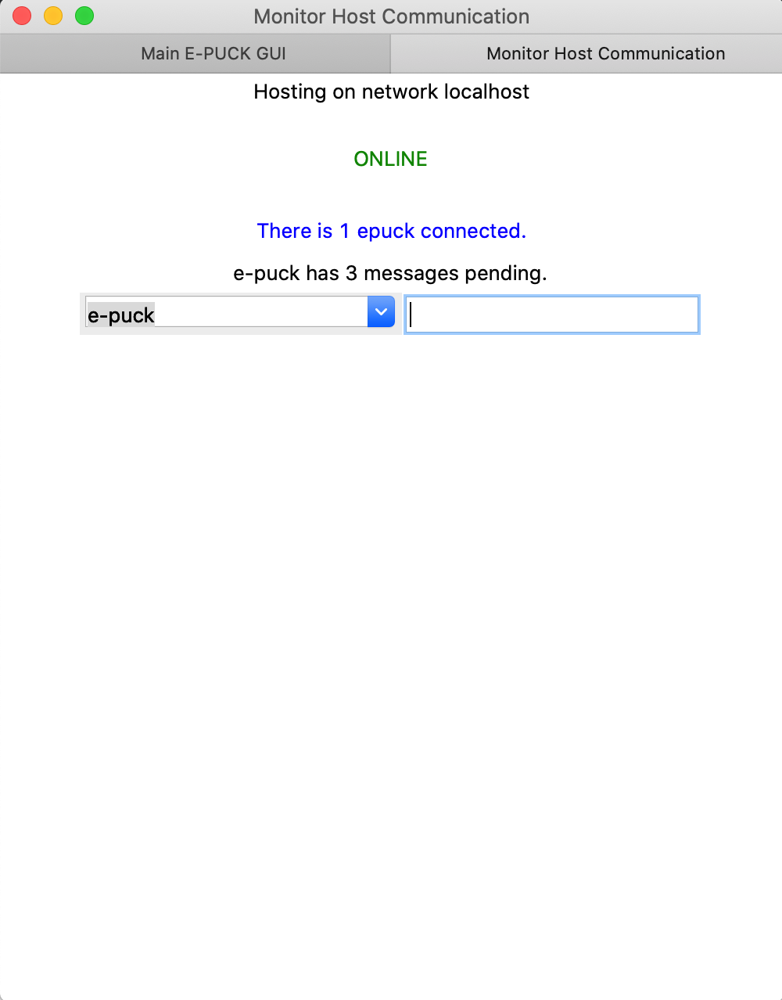
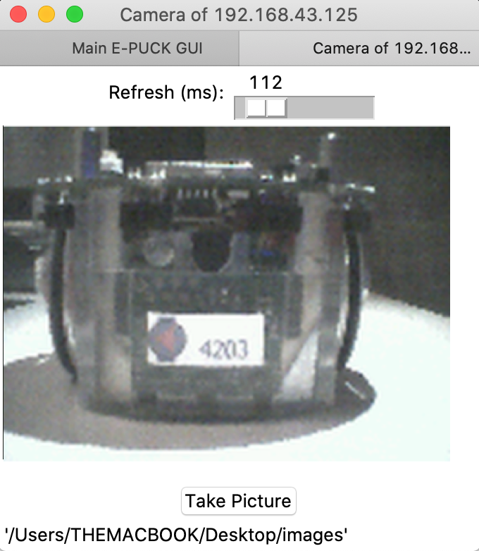

Graphic User Interface
============================

Main e-puck GUI Window
----------------------------

To start the main GUI from the unifr_api_epuck package, please run the following command in your terminal:

.. code-block:: shell

    $ python3 -m unifr_api_epuck

    
The main e-puck GUI is able to start a server host for the communication between robots and/or start streaming the camera of an e-puck.

The window is split into two parts:

1. The first part is for creating or joining the communication.

    Two scenarios are possible :

    * If no host exists: you can create one by inserting the computer IP address in the input field.

    * If a host already exists: insert the IP address of the host to join.

2.  The second part is to stream the camera of an e-puck.
    
    2.1 Insert the IP address of the robot to stream.

    2.2 Locate the folder where the pictures are saved from the robot.

    .. note:: 

        * To use this feature, the e-puck must be run by the same computer that streams the camera.

        * This should be the same path as rob.init_camera(`path`) of the e-puck 

    .. tip::

        First define the location from the GUI and then copy/paste the path into the init_camera(`path`) method in the controller code of the robot.

Also note that the GUI will create a .json file to save your inputs in order that you don't have to insert them each time your launching the GUI.

Monitor Host Communication
------------------------------

In this window, you will be able to :
 
* Monitor how many pending messages the e-pucks have.
* Send messages to robots.

If a robot loses the communication with the host, then it will disappear from the list and all its pending messages will be removed.

e-puck Camera
--------------

* You can move the slider to adjust the refresh rate of the stream.
* You can take a picture of the steam and it will save it on the same directory specified before.
* Copy/Paste the directory link.

